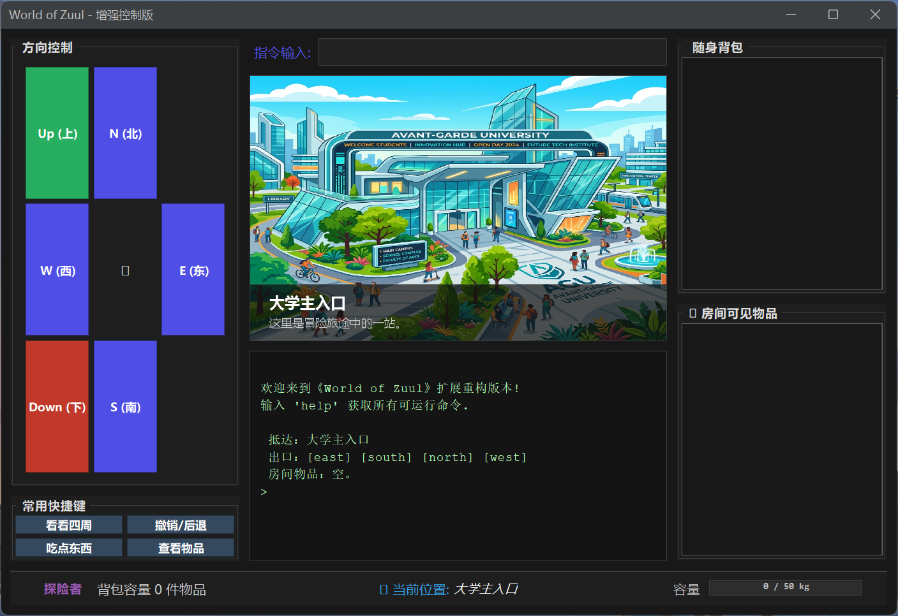

# World of Zuul - 增强重构版

## 一、 项目简介

本项目是基于经典文字冒险游戏 **World of Zuul** 的深度重构与功能增强版本。作为**武汉理工大学《软件工程实训》任务二**的成果，本项目不仅在原有命令行基础上实现了现代化的 **Swing GUI 交互界面**，还引入了复杂的**负重系统**、**路径回退栈**、**随机传送门**以及**剧情触发状态机**。

玩家将扮演一名在大学校园中迷失的探险者，通过寻找关键道具、破解空间迷阵、管理随身负重，最终重启能源反应堆，成为校园的英雄。

项目严格遵循面向对象设计原则，采用 **命令模式解耦** 逻辑，并集成了 **Checkstyle** 代码规范检查与 **JUnit 5** 自动化测试，通过 **GitHub Actions** 实现了完整的 CI/CD 流程。
### 界面预览

---

## 二、 核心特性

### 1. 现代化图形交互 (GUI)
*   **多功能面板**：采用**FlatLaf**深色主题，集成场景渲染图、操作日志、实时方向罗盘。
*   **可视化状态栏**：动态显示当前位置、背包物品数量及实时负重条（颜色随负载比例变化）。
*   **右键交互**：支持在背包或房间列表中通过右键菜单直接执行“捡起”、“丢弃”或“使用”操作。

### 2. 深度物品与玩家系统
*   **负重限制**：玩家有初始负重上限，物品具有不同重量。
*   **特殊道具逻辑**：
    *   **魔法饼干/登山包**：使用后可永久提升负重上限。
    *   **重力背带**：被动道具，使背包内其他物品重量减轻 20%。
    *   **战术手电**：进入“黑暗储藏室”或“下水道”时，必须持有手电才能看清房间物品。
    *   **辐射盾牌**：进入核心反应堆区域的必要凭证。

### 3. 高级空间探索
*   **全路径回退**：通过 `back` 指令利用栈结构（Stack）实现逐层回退，直至起点。
*   **传送门系统**：进入“虚空之眼”会被随机传送到地图任一位置；若持有**量子指南针**，则可精准定位。
*   **动态环境**：
    *   **迷雾园林**：若无指南针，移动时有概率迷失方向返回原点。
    *   **隐藏房间**：携带“黄铜钥匙”进入实验室可触发机关，开启通往地下机房的暗门。

### 4. 自动化与规范
*   **单元测试**：基于 JUnit 5 覆盖了负重计算、回退逻辑、随机传送等核心引擎。
*   **规范检查**：集成 Maven Checkstyle 插件，严格遵循 Google Java 编程规范。
---

## 三、 技术栈

| 维度 | 技术/工具 |
| :--- | :--- |
| **开发语言** | Java 10+ |
| **构建管理** | Maven 3.x |
| **UI 框架** | Java Swing + FlatLaf (Dark Mode) |
| **单元测试** | JUnit 5 |
| **代码规范** | Checkstyle|
| **持续集成** | GitHub Actions |

---

## 四、启动项目

### 环境要求
*   Java JDK 10 或更高版本
*   Maven 3.6+

### 编译与运行
1.  **克隆仓库**
2.  **构建项目**（自动运行测试并打包）
3.  **启动游戏**：启动Main.java
---

## 五、 游戏操作指南
### 1. 空间移动
*   **方向罗盘**：点击左侧面板的 **[N] [S] [E] [W]** 按钮进行基准方向移动；点击 **[Up]** 或 **[Down]** 按钮进入阁楼、地下室或暗门通道。
*   **指令输入**：在顶部输入框输入 `go north` 等指令并回车。
*   **路径撤销**：点击快捷键面板的 **[撤销/后退]** 按钮，可利用“回退栈”逐层返回之前的房间。

### 2. 物品交互
本项目实现了高度集成的右键菜单交互：
*   **拾取物品**：在右侧 **[房间可见物品]** 列表中，**右键点击**目标（如“魔法饼干”），选择 `捡起物品`。
*   **丢弃物品**：在右侧 **[随身背包]** 列表中，**右键点击**已有物品，选择 `丢弃物品`。
*   **使用/食用**：
    *   **一键进食**：点击快捷键面板的 **[吃点东西]**，程序将自动搜寻背包内的饼干并消耗，增加负重上限。
    *   **手动触发**：在背包列表中对饼干或装备（如登山包）点击右键，选择 `吃掉` 或 `装备/背上`。

### 3. 状态感知 
*   **负重进度条**：右下角实时显示当前负重百分比。
    *   🟢 **绿色**：负重安全。
    *   🟠 **橙色**：负载较高（超过 80%）。
    *   🔴 **红色**：濒临上限或超载，此时将无法拾取新物品。
*   **环境感知**：
    *   **场景卡片**：中间面板会渲染当前房间的插画，并根据房间属性显示状态（如“空间折叠警报”或“环境幽暗”）。
    *   **黑暗逻辑**：若进入黑暗房间且未持有“战术手电”，房间物品列表将保持隐藏。

### 4. 快捷辅助
*   **看看四周**：点击后在日志区刷新当前环境的深度描述及出口信息。
*   **查看物品**：点击后在日志区打印当前房间与个人背包的详细重量清单。
*   **文本模式**：熟练玩家可直接在顶部输入框输入 `take all` 或 `drop all` 执行批量操作。

---

###  核心操作一览表

| 目标动作 | GUI 鼠标操作 | 对应文本指令 |
| :--- | :--- | :--- |
| **向北移动** | 点击罗盘 [N] 按钮 | `go north` |
| **返回起点** | 连续点击 [撤销/后退] | 连续输入 `back` |
| **一键拾取** | 文本框输入 `take all` | `take all` |
| **增加容量** | 背包右键点击饼干 -> 吃掉 | `eat 魔法饼干` |
| **精准传送** | 持有指南针进入“虚空之眼” | (自动触发) |
| **开启暗门** | 携带“黄铜钥匙”进入实验室 | (自动触发) |

---

## 六、 工程规范

本项目高度重视代码质量与工程规范：
1.  **Checkstyle 强制约束**：在构建过程中自动运行 Google 代码规范检查，不符合规范的代码将导致构建失败。
2.  **自动化测试**：
    *   `GameLogicTest`: 验证回退栈、随机传送逻辑。
    *   `PlayerTest`: 验证负重计算与物品交互。
    *   `GameGUITest`: 模拟 UI 点击测试事件响应。
3.  **CI/CD 流水线**：每当代码 Push 到 GitHub，Actions 都会自动执行规范检查、运行测试并生成可分发的 Artifacts。

---

## 七、 小组分工

*   **组员A（首席架构师/GUI负责人）朱子玮**：负责“空间”与“视觉”。
*   **组员B（逻辑开发工程师/交互负责人）连征**：负责“动作”与“剧情”。
*   **组员C（质量与运维工程师/数据负责人）郑博**：负责“状态”与“交付”。

---
